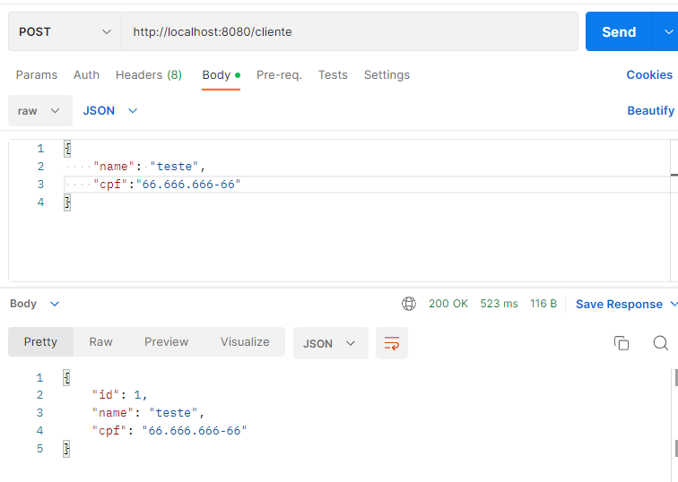
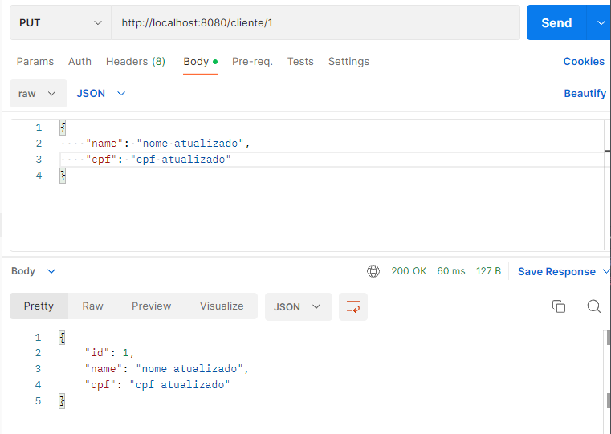
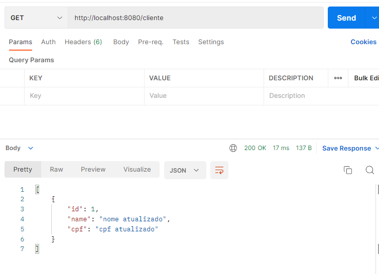

## criando aplicação

### configuração necessária

    spring.r2dbc.url=r2dbc:postgresql://localhost:5432/customerdb
    spring.r2dbc.username=admin
    spring.r2dbc.password=admin

### interface repository 

    @Repository
    public interface CustomerRepository extends ReactiveCrudRepository<Customer, Integer> {
    }

### exemplo de classe da tabela

    @Data
    @ToString
    @Table(value = "tb_customer")
    public class Customer {
    @Id
    private Integer id;
    private String name;
    private String cpf;
    }
> espera-se que exista um banco disponível durante a execução da aplicação para realizar as operações na tabela de inserção e listagem por ex.
> 
## testando aplicação

### criando um novo dado 

### atualizando dado cadastrado

### retornando dados cadastrados 
