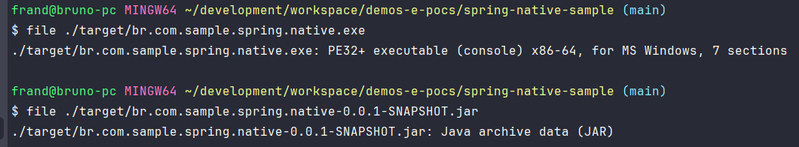

# Projeto teste utilizando o spring native 

# Requisitos minimos

- graalvm ou docker instalado
- jdk 17
- maven

## preparando o ambiente

### windows: 
* baixar a jdk graalvm
  * sdk install java 17.0.9-graal
  * sdk use 17.0.9-graal
* instalar visual studio installer
  https://visualstudio.microsoft.com.
  * instalar pacote Desenvolvimento para Desktop com c++
  * sdk windows
  * msvc v142
#### método alternativo
* instalar docker https://docs.docker.com/desktop/install/windows-install/

# como testar

para testar a aplicação siga os passos abaixo.

## via graalvm

na pasta da aplicação executar o trecho abaixo no terminal:

```shell
mvn -Pnative native:compile
```
ira iniciar a compilação usando a graalvm
```text
GraalVM Native Image: Generating 'br.com.sample.spring.native' (executable)...
```

para executar siga o passo abaixo:
```shell
 ./target/br.com.sample.spring.native.exe 
```
ira iniciar a aplicação(em tempo absurdo de rapido)
```shell
  .   ____          _            __ _ _
 /\\ / ___'_ __ _ _(_)_ __  __ _ \ \ \ \
( ( )\___ | '_ | '_| | '_ \/ _` | \ \ \ \
 \\/  ___)| |_)| | | | | || (_| |  ) ) ) )
  '  |____| .__|_| |_|_| |_\__, | / / / /
 =========|_|==============|___/=/_/_/_/
 :: Spring Boot ::                (v3.1.5)

2023-11-01T23:05:27.904-03:00  INFO 21724 --- [           main] c.e.demo.SpringNativeSampleApplication   : Starting AOT-processed SpringNativeSampleApplication using Java 17.0.9 with PID 21724 (C:\Users\frand\development\workspace\demos-e-pocs\spring-native-sample\target\br.com.sample.spring.native.exe started by frand in C:\Users\frand\development\workspace\demos-e-pocs\spring-native-sample)
2023-11-01T23:05:27.904-03:00  INFO 21724 --- [           main] c.e.demo.SpringNativeSampleApplication   : No active profile set, falling back to 1 default profile: "default"
2023-11-01T23:05:27.932-03:00  INFO 21724 --- [           main] o.s.b.w.embedded.tomcat.TomcatWebServer  : Tomcat initialized with port(s): 8080 (http)
2023-11-01T23:05:27.933-03:00  INFO 21724 --- [           main] o.apache.catalina.core.StandardService   : Starting service [Tomcat]
2023-11-01T23:05:27.933-03:00  INFO 21724 --- [           main] o.apache.catalina.core.StandardEngine    : Starting Servlet engine: [Apache Tomcat/10.1.15]
2023-11-01T23:05:27.943-03:00  INFO 21724 --- [           main] o.a.c.c.C.[Tomcat].[localhost].[/]       : Initializing Spring embedded WebApplicationContext
2023-11-01T23:05:27.943-03:00  INFO 21724 --- [           main] w.s.c.ServletWebServerApplicationContext : Root WebApplicationContext: initialization completed in 39 ms
2023-11-01T23:05:27.959-03:00  INFO 21724 --- [           main] o.s.b.w.embedded.tomcat.TomcatWebServer  : Tomcat started on port(s): 8080 (http) with context path ''
2023-11-01T23:05:27.959-03:00  INFO 21724 --- [           main] c.e.demo.SpringNativeSampleApplication   : Started SpringNativeSampleApplication in 0.067 seconds (process running for 0.07)
```

para estimular a aplicação realize o curl abaixo

```shell
curl --request GET \
  --url http://localhost:8080/ 
```

resposta:

```json
Hello World!
```
## via image docker

execute o trecho abaixo no terminal:
```shell
mvn -Pnative spring-boot:build-image
```
ira criar uma imagem da aplicação com a graalvm

```text
Successfully built image 'docker.io/library/br.com.sample.spring.native:0.0.1-SNAPSHOT'
```

para executar siga o passo abaixo:
```shell
docker run --rm -p 8080:8080 br.com.sample.spring.native:0.0.1-SNAPSHOT
```
tera o seguinte resultado abaixo:
```shell
  .   ____          _            __ _ _
 /\\ / ___'_ __ _ _(_)_ __  __ _ \ \ \ \
( ( )\___ | '_ | '_| | '_ \/ _` | \ \ \ \
 \\/  ___)| |_)| | | | | || (_| |  ) ) ) )
  '  |____| .__|_| |_|_| |_\__, | / / / /
 =========|_|==============|___/=/_/_/_/
 :: Spring Boot ::                (v3.1.5)

2023-11-02T02:33:33.392Z  INFO 1 --- [           main] c.e.demo.SpringNativeSampleApplication   : Starting AOT-processed SpringNativeSampleApplication using Java 17.0.7 with PID 1 (/workspace/com.example.demo.SpringNativeSampleApplication started by cnb in /workspace)
2023-11-02T02:33:33.392Z  INFO 1 --- [           main] c.e.demo.SpringNativeSampleApplication   : No active profile set, falling back to 1 default profile: "default"
2023-11-02T02:33:33.403Z  INFO 1 --- [           main] o.s.b.w.embedded.tomcat.TomcatWebServer  : Tomcat initialized with port(s): 8080 (http)
2023-11-02T02:33:33.403Z  INFO 1 --- [           main] o.apache.catalina.core.StandardService   : Starting service [Tomcat]
2023-11-02T02:33:33.403Z  INFO 1 --- [           main] o.apache.catalina.core.StandardEngine    : Starting Servlet engine: [Apache Tomcat/10.1.15]
2023-11-02T02:33:33.410Z  INFO 1 --- [           main] o.a.c.c.C.[Tomcat].[localhost].[/]       : Initializing Spring embedded WebApplicationContext
2023-11-02T02:33:33.410Z  INFO 1 --- [           main] w.s.c.ServletWebServerApplicationContext : Root WebApplicationContext: initialization completed in 18 ms
2023-11-02T02:33:33.433Z  INFO 1 --- [           main] o.s.b.w.embedded.tomcat.TomcatWebServer  : Tomcat started on port(s): 8080 (http) with context path ''
2023-11-02T02:33:33.433Z  INFO 1 --- [           main] c.e.demo.SpringNativeSampleApplication   : Started SpringNativeSampleApplication in 0.048 seconds (process running for 0.052)

```
### diferenciação dos arquivos de execução
