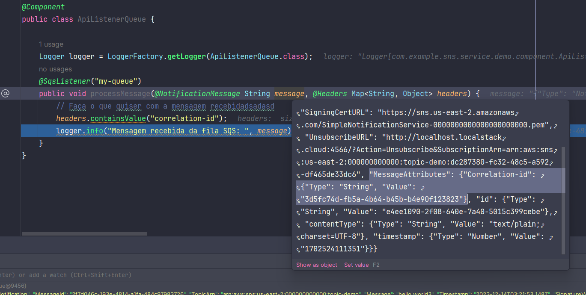

+ cria o tpico
```shell
aws --endpoint-url http://localhost:4566 sns create-topic --name topic-demo
```
+ publica uma mensagem no topico
```shell
aws --endpoint-url http://localhost:4566 sns publish --topic-arn arn:aws:sns:us-east-2:000000000000:topic-demo --message "Hello, World!"
```
> dependendo da configuração da regição que está no docker-compose é preciso atualizar o ARN  que está no snipet

+ lista as mensagens presentes no topico
```shell
aws --endpoint-url http://localhost:4566 sns list-messages --topic-arn arn:aws:sns:us-east-2:000000000000:topic-demo
```


# SQS

+ Cria uma fila SQS
```shell
aws --endpoint-url=http://localhost:4566 sqs create-queue --queue-name my-queue
```


